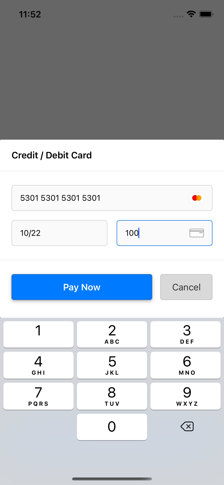
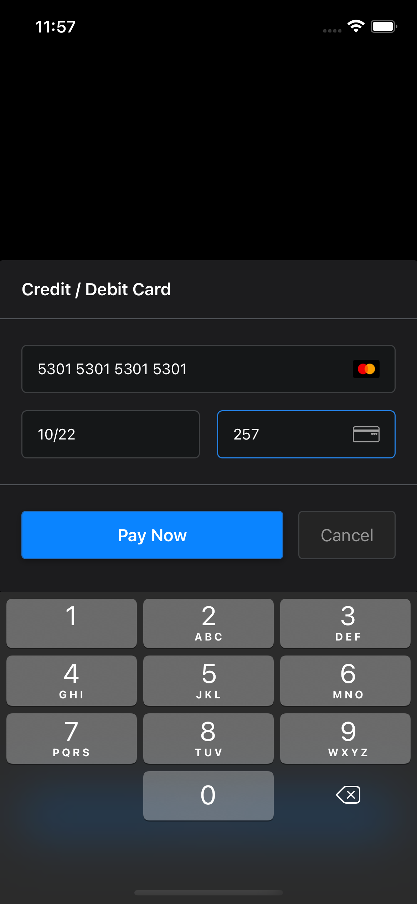

# Ryft iOS

[](https://github.com/RyftPay/ryft-ios/actions/workflows/build-and-test.yml) [](LICENSE)

Ryft for iOS allows you to accept in-app payments securely and safely using our customisable UI elements.

 

## Requirements

- iOS 11.0+
- Xcode 11.0+
- Swift 5+

## Installation

Ryft iOS is available via:

- [Swift Package Manager](https://swift.org/package-manager/)

### Swift Package Manager

See Apple's [Guide](https://developer.apple.com/documentation/xcode/adding_package_dependencies_to_your_app) on how to add Swift packages to your app.

Use https://github.com/RyftPay/ryft-ios as the repository URL.

## Usage

The drop-in component provides you with all the necessary functions in order to enter and pay with your customer's card details.

The drop-in will handle formatting and input error as your user's type.

For the following steps, ensure you've imported the relevant Ryft packages:

```swift
import RyftCore
import RyftUI
```

### Initialising the drop-in

You should store and initialise the drop-in on the view which handles your checkout process.

```swift
private var ryftDropIn: RyftDropInPaymentViewController?

@objc private func showDropIn() {
    ryftDropIn = RyftDropInPaymentViewController(
        config: RyftDropInConfiguration(
            clientSecret: "<the client secret of the payment-session>",
            accountId: "nil | <the Id of the sub-account you are taking payments for>"
        ),
        publicApiKey: "<your public API key",
        delegate: self
    )
    present(ryftDropIn!, animated: true, completion: nil)
}
```

Under the hood the drop-in will detect the appropriate environment based on your public API key.

### Implementing the RyftDropInPaymentDelegate

Once the customer has submitted their payment, the drop-in will dismiss.

To handle the result, the following methods of `RyftDropInPaymentDelegate` need to be implemented:

```swift
func onPaymentResult(result: RyftPaymentResult)
```

This method is invoked once the customer has entered their payment method details and submitted the payment

**Example:**

```swift
func onPaymentResult(result: RyftPaymentResult) {
    switch result {
    // payment approved, send the customer to your receipt/success view
    case .success:
        showSuccessView()
    // payment requires an additional action in order to be approved (e.g. 3ds)
    case .pendingAction(let paymentSession, let requiredAction):
        // instruct the drop-in to handle the action
        ryftDropIn?.handleRequiredAction(
            returnUrl: paymentSession.returnUrl,
            requiredAction
        )
    // payment failed, show an alert to the customer
    // `error.displayError` provides a human friendly message you can display
    case .failed(let error):
        let alert = UIAlertController(
            title: "Error taking payment",
            message: error.displayError,
            preferredStyle: .alert
        )
        alert.addAction(UIAlertAction(title: "Cancel", style: .cancel, handler: nil))
        alert.addAction(UIAlertAction(title: "Try again", style: .default) { _ in
            self.showDropIn()
        })
        present(alert, animated: true, completion: nil)
    }
}
```

### Customising the drop-in

You can customise the appearance the drop-in by passing in your own `RyftUITheme` instance.

**Example:**

```swift
let myTheme = RyftUITheme.defaultTheme
myTheme.separatorLineColor = .blue
// set various other colors
ryftDropIn = RyftDropInPaymentViewController(...)
ryftDropIn.theme = myTheme
present(ryftDropIn, animated: true, completion: nil)
```
