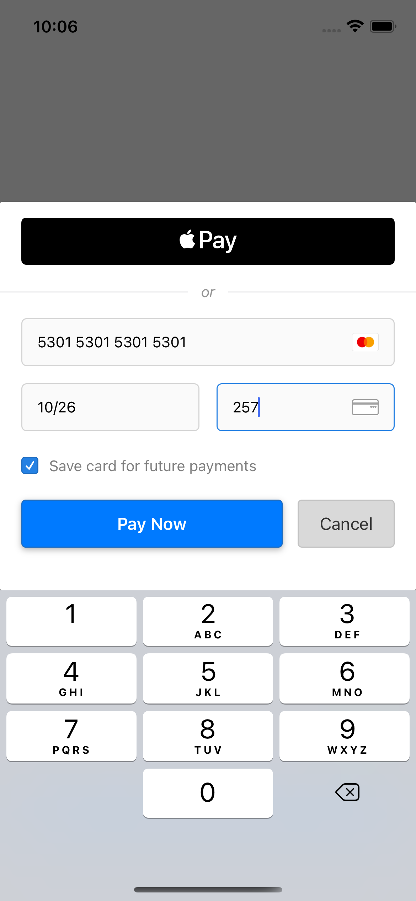

# Ryft iOS

[](https://github.com/RyftPay/ryft-ios/actions/workflows/build-and-test.yml) [](LICENSE)

Ryft for iOS allows you to accept in-app payments securely and safely using our customisable UI elements.

 

## Requirements

- iOS 11.0+
- Xcode 11.0+
- Swift 5+

## Installation

Ryft iOS is available via:

- [Swift Package Manager](https://swift.org/package-manager/)

### Swift Package Manager

See Apple's [Guide](https://developer.apple.com/documentation/xcode/adding_package_dependencies_to_your_app) on how to add Swift packages to your app.

Use https://github.com/RyftPay/ryft-ios as the repository URL.

## Usage

The drop-in component provides you with all the necessary functions in order to enter and pay with your customer's card details.

The drop-in will handle formatting and input error as your user's type.

For the following steps, ensure you've imported the relevant Ryft packages:

```swift
import RyftCore
import RyftUI
```

### Initialising the drop-in

You should store and initialise the drop-in on the view which handles your checkout process.

```swift
private var ryftDropIn: RyftDropInPaymentViewController?

@objc private func showDropIn() {
    ryftDropIn = RyftDropInPaymentViewController(
        config: RyftDropInConfiguration(
            clientSecret: "<the client secret of the payment-session>",
            accountId: "nil | <the Id of the sub-account you are taking payments for>"
        ),
        publicApiKey: "<your public API key",
        delegate: self
    )
    present(ryftDropIn!, animated: true, completion: nil)
}
```

Under the hood the drop-in will detect the appropriate environment based on your public API key.

### Implementing the RyftDropInPaymentDelegate

Once the customer has submitted their payment, the drop-in will dismiss.

To handle the result, the following methods of `RyftDropInPaymentDelegate` need to be implemented:

```swift
func onPaymentResult(result: RyftPaymentResult)
```

This method is invoked once the customer has entered their payment method details and submitted the payment

**Example:**

```swift
func onPaymentResult(result: RyftPaymentResult) {
    switch result {
    // payment approved, send the customer to your receipt/success view
    case .success:
        showSuccessView()
    // payment requires an additional action in order to be approved (e.g. 3ds)
    case .pendingAction(let paymentSession, let requiredAction):
        // instruct the drop-in to handle the action
        ryftDropIn?.handleRequiredAction(
            returnUrl: paymentSession.returnUrl,
            requiredAction
        )
    // payment failed, show an alert to the customer
    // `error.displayError` provides a human friendly message you can display
    case .failed(let error):
        let alert = UIAlertController(
            title: "Error taking payment",
            message: error.displayError,
            preferredStyle: .alert
        )
        alert.addAction(UIAlertAction(title: "Cancel", style: .cancel, handler: nil))
        alert.addAction(UIAlertAction(title: "Try again", style: .default) { _ in
            self.showDropIn()
        })
        present(alert, animated: true, completion: nil)
    }
}
```

## Adding Apple Pay

If you want to offer Apple Pay then simply add the necessary config when initialising the drop-in:

```swift
@objc private func showDropIn() {
    ryftDropIn = RyftDropInPaymentViewController(
        config: RyftDropInConfiguration(
            clientSecret: "<the client secret of the payment-session>",
            accountId: "nil | <the Id of the sub-account you are taking payments for>",
            applePay: RyftApplePayConfig(
                merchantIdentifier: "merchant.com.<you>",
                merchantCountryCode: "GB",
                merchantName: "<your merchant name to display on the Apple Pay sheet>"
            )
        ),
        publicApiKey: "<your public API key",
        delegate: self
    )
    present(ryftDropIn!, animated: true, completion: nil)
}
```

We will automatically display Apple Pay as an option provided your config is correct and the customer has an eligible card setup in their wallet.

### Using Apple Pay as a standalone payment option

It's considered best practice to offer Apple Pay as early as possible. For example, you may want to display it as early as a product listing/product page.

You can use our `RyftApplePayComponent` by itself (without the drop-in controller) if you wish to facilitate this.

#### Initialise the component

You can initialise the component in one of two ways:

- `RyftApplePayComponentConfig.auto` - let Ryft construct and populate the information on the Apple Pay sheet
- `RyftApplePayComponent.manual` - handle constructing Apple's `PKPaymentRequest` yourself

We recommend using `.auto`. This ensures that the financials displayed to the customer match what Ryft expects when authorizing the payment and reduces the chance of the payment failing due to an inconsistency on the client-side and backend.

```swift
@objc private func applePayButtonClicked() {
    let config = RyftApplePayConfig(
        merchantIdentifier: "<your merchant ID>",
        merchantCountryCode: "GB",
        merchantName: "<your merchant name to display on the Apple Pay sheet>"
    )
    // create a fresh instance each time you want to display the ApplePay sheet
    let applePayComponent = RyftApplePayComponent(
        publicApiKey: "<your public API key>",
        clientSecret: config.clientSecret,
        accountId: "nil | <the Id of the sub-account you are taking payments for>",
        config: .auto(config: config),
        delegate: self
    )
    applePayComponent?.present { presented in
        if !presented {
            /*
            * something went wrong with presenting the ApplePay sheet
            * show an alert or retry
            */
            self.applePayButton.isEnabled = true
        }
    }
}
```

#### Implementing the RyftApplePayComponentDelegate

Once the customer has submitted their payment, the drop-in will dismiss.

To handle the result, the following methods of `RyftDropInPaymentDelegate` need to be implemented:

```swift
func applePayPayment(
    finishedWith status: RyftApplePayComponent.RyftApplePayPaymentStatus
)
```

This method is invoked with one of several states:

```swift
 // user dismissed/cancelled the Apple Pay sheet
case cancelled
// either an unexpected error occurred or the payment failed to authorize
case error(error: Error?, paymentError: RyftPaymentError?)
// payment successful, show a receipt view
case success(paymentSession: PaymentSession)
```

**Example:**

```swift
public func applePayPayment(
    finishedWith status: RyftApplePayComponent.RyftApplePayPaymentStatus
) {
    applePayButton.isEnabled = true
    switch status {
    case .cancelled:
        break
    case .success(let paymentSession):
        /*
        * display your receipt/success view
        * the Ryft payment session is returned should you want to use
        * any of the values on it
        */
        showSuccessView()
    case .error(_, let paymentError):
        // payment failed, show an alert to the customer
        // `paymentError.displayError` provides a human friendly message you can display
        let alert = UIAlertController(
            title: "Error taking payment",
            message: error.displayError,
            preferredStyle: .alert
        )
        alert.addAction(UIAlertAction(title: "Cancel", style: .cancel, handler: nil))
        alert.addAction(UIAlertAction(title: "Try again", style: .default) { _ in
            self.applePayClicked()
        })
        present(alert, animated: true, completion: nil)
    }
}
```

### Using the drop-in for setting up cards for future use

A common use-case for some businesses is setting up and storing cards without charging the customer.
This is also known as zero-value authorization or account verification.


The drop-in currently has 2 usages:
 - `payment` (your customer is actively checking out and completing a purchase)
 - `setupCard` (your customer wants to save their card for future use without incurring any charges)

By default we will use `payment`, however to customise the view simply pass the `displayConfig` flag when initialising the drop-in:

```swift
RyftDropInConfiguration(
    clientSecret: "<the client secret of the payment-session>",
    accountId: nil, // account verifications must be done via the standard account holder.
    displayConfig: RyftDropInConfiguration.RyftDropInDisplayConfig(
        payButtonTitle: nil,
        usage: .setupCard
    )
    applePay: nil // we recommend leaving this nil to hide Apple Pay
)
```


### Customising the drop-in

You can customise the appearance the drop-in by passing in your own `RyftUITheme` instance.

**Example:**

```swift
let myTheme = RyftUITheme.defaultTheme
myTheme.separatorLineColor = .blue
// set various other colors
ryftDropIn = RyftDropInPaymentViewController(...)
ryftDropIn.theme = myTheme
present(ryftDropIn, animated: true, completion: nil)
```
